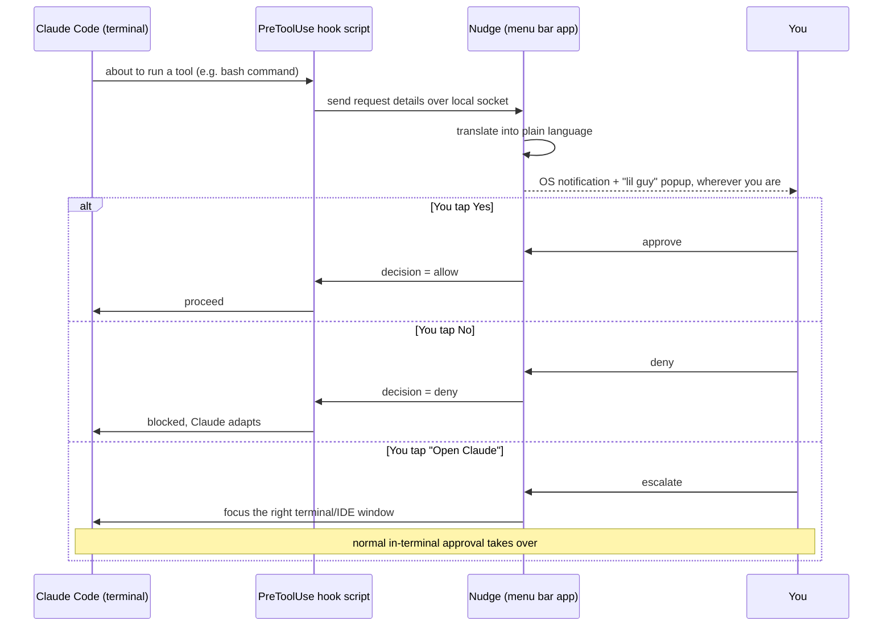

# PRD: Claude Code Approval Notifier ("Nudge")

**Status:** Draft v1
**Owner:** pkashyap@uw.edu
**Date:** 2026-08-01
**Platform target:** macOS (menu bar app)

---

## 1. Problem

Claude Code stops and waits for your approval before doing things like running a shell command, editing a file, or hitting a URL. Today, that prompt only shows up **in the terminal window Claude Code is running in**. If you've switched to a different screen — Slack, a browser, another app — you get no signal. You end up assuming Claude is still working in the background, when it's actually idle, blocked on you.

The result: wasted time, broken flow, and Claude sitting idle far longer than it needs to.

## 2. Goal

A small always-available background agent that:

1. Notices the instant Claude Code needs your approval (or is idle waiting on you), **no matter what app or screen you're currently on**.
2. Shows you a **plain-language, one-line explanation** of what it wants to do — not raw command syntax.
3. Lets you **approve or deny right there**, without switching to the Claude Code terminal.
4. Gives you an escape hatch to **open the real session** when a request needs closer inspection.
5. Has a **master on/off switch**, so it stays silent when you're already sitting in Claude Code directly.

## 3. Non-goals (v1)

- Not covering Claude.ai web/desktop chat — scoped to **Claude Code** (terminal/IDE) only. Revisit later if Claude.ai exposes an equivalent hook/webhook.
- Not building an auto-approval / rules engine (e.g. "always allow `git status`") — flagged as a v2 idea, see §12.
- Not cross-platform at launch — macOS only, matching your current machine. Windows/Linux is a possible v2.
- Not a mobile app / push-to-phone in v1 — see §12.

## 4. How this is technically possible

Claude Code has a **hooks** system: it can run a small script of yours at specific lifecycle moments and, for some hook types, wait for that script to tell it what to do next. Two hook types matter here:

| Hook | Fires when | Can it gate the action? |
|---|---|---|
| `Notification` | Claude needs permission, or has been idle 60s+ waiting on you | No — informational only, fires *after* the terminal prompt is already showing |
| `PreToolUse` | Right before Claude runs any tool (bash command, file edit, web fetch, etc.) | **Yes** — your script can tell Claude to allow, deny, or fall back to asking, before the terminal prompt ever appears |

`PreToolUse` is the one that makes "tap yes/no without opening Claude" actually work: your hook script runs, pauses Claude, asks *you* (via the menu bar app), and only then reports the decision back — Claude never shows its own terminal prompt for approvals your app resolved.

**Technical risk to validate first (see §10, M0):** the exact input/output contract of `PreToolUse` (what data about the pending action it gives you, and the exact format for returning an allow/deny decision) needs to be confirmed against the current Claude Code docs/version before building on it — hook contracts are the kind of thing that shifts between releases.

## 5. Core user flow

If Nudge is **off**, or if it can't reach the hook (app not running), Claude Code just falls back to its normal terminal prompt — nothing breaks.

## 6. Functional requirements

### P0 — must have for v1

1. **Background listener**: a lightweight process/menu bar app that's always running, listens for hook events from any active Claude Code session on the machine.
2. **Master on/off toggle**: one click in the menu bar to disable. While off, all Claude Code sessions behave exactly as they do today (normal terminal prompts, no interception).
3. **System-level notification**: uses native macOS notifications so it surfaces regardless of which app is focused — including **actionable buttons directly on the notification** (macOS supports Approve/Deny as buttons on the banner itself, no need to open anything).
4. **"Lil guy" widget**: a small floating popover/panel (anchored to the menu bar icon) that appears alongside the notification, showing the same info in a friendlier, more persistent form — useful if the OS notification banner disappears before you see it.
5. **Plain-language summary**: every request is translated out of raw tool syntax into one short sentence, e.g.:
   - Raw: `rm -rf node_modules/`  → *"Claude wants to delete the node_modules folder in **cool-app**."*
   - Raw: `git push --force origin main` → *"Claude wants to force-push over main on **cool-app**. This can overwrite others' work."*
   - Raw: editing `config/prod.env` → *"Claude wants to edit a file that looks like a production config: **prod.env**."*
6. **Inline Yes/No**: tapping Yes/No on the notification or the widget resolves the pending approval immediately — Claude proceeds or is blocked without you touching the terminal.
7. **"Open Claude" escalation**: a third button/action that, instead of deciding, jumps you straight to the exact terminal tab / IDE window that's waiting, for anything that needs a closer look. This should always be available, not just offered when Nudge is unsure — you get final say.
8. **Session identification**: every notification names *which* project/session is asking (working directory or a session label), since you likely run more than one Claude Code session at a time.
9. **Queueing**: if multiple approvals come in before you respond, they queue in the widget rather than spawning a pile of OS notifications.

### P1 — should have soon after v1

10. **Risk-based defaults**: requests Nudge classifies as higher-risk (deleting files, force-push, `sudo`, touching anything that looks like secrets/credentials/prod) are visually flagged (e.g. red accent) and default focus lands on "Open Claude" / "No" rather than "Yes", to reduce fat-finger approvals of dangerous actions.
11. **Do-not-disturb / quiet hours**: suppress notifications (but still queue them) during set hours or when a focus mode is active.
12. **Sound + badge**: distinct, non-annoying sound and a menu bar badge count for unread/pending approvals.
13. **Timeout handling**: if you don't respond within N minutes, Nudge stops holding the terminal hostage and just lets the normal in-terminal prompt appear (safe fallback, matches today's behavior).

### P2 — nice to have, later

14. Per-project or per-command-type mute ("don't ask again for `npm test` in this repo" — feeds into a future rules engine, see §12).
15. History log of past approvals/denials, viewable in the widget.

## 7. UX notes on the "lil guy"

- Lives as a menu bar icon (always visible, shows state: idle / waiting-on-you / off).
- Click the icon any time to open the panel manually and see anything pending.
- When a new request comes in, the panel can auto-pop briefly near the menu bar (like a mini Control Center panel) *and* fire the OS notification — belt and suspenders, since banners can be missed.
- Panel content per request: project name, plain-language sentence, a collapsed "show me the raw command" toggle for anyone who wants detail, and three buttons: **Yes**, **No**, **Open Claude**.
- Toggle switch for on/off is the first thing in the panel — always one click away.

## 8. Notification content — do's and don'ts

- **Do** lead with what Claude wants to *do*, in everyday language, and *where* (project name).
- **Do** call out anything destructive, irreversible, or touching credentials/production in the first sentence, not buried.
- **Don't** just paste the raw bash command as the whole notification — that's the exact problem being solved (you'd have to context-switch to parse it).
- **Don't** silently auto-simplify away real risk — if Nudge can't confidently summarize a request, say so explicitly ("Claude wants to run a command I couldn't simplify — take a look") and steer toward "Open Claude" rather than guessing.

## 9. Architecture (macOS v1)

- **Menu bar app** (SwiftUI + `NSStatusItem`) — the "lil guy," owns the UI, the on/off toggle, and posts native notifications via `UNUserNotificationCenter` (with custom notification categories for Approve/Deny actions).
- **Local listener** — the app also runs a small local IPC endpoint (Unix domain socket or localhost-only port) that hook scripts talk to. Local-only, no network exposure.
- **Hook scripts** — installed into Claude Code's hook config (`PreToolUse`, `Notification`) for every project, or globally. Each invocation: gather the pending tool-call details, send to the local listener, **block and wait** for a decision (with a timeout), then emit that decision back to Claude Code in whatever format it expects.
- **Summarizer** — a small rules/template layer mapping common tool types (Bash, Edit, Write, WebFetch, etc.) and common risky patterns (`rm -rf`, `--force`, `sudo`, paths containing `prod`/`.env`/`secret`) to plain-language sentences. Keep this local and fast (no extra API call) for P0; consider an LLM-assisted summary as a P1 fallback for commands the rules don't recognize.
- **Session registry** — tracks which terminal/IDE window/session each pending request came from, so "Open Claude" can actually focus the right one.

## 10. Milestones

- **M0 — Spike (few days):** Confirm exactly what data `PreToolUse` hooks receive and how a hook communicates an allow/deny decision back to Claude Code, on the currently installed Claude Code version. This determines whether full inline gating (§4) is achievable as designed, or whether v1 needs to fall back to "notify + one-click focus the terminal" for the first release.
- **M1 — MVP:** Menu bar app, on/off toggle, `Notification`-hook-based alerts (Claude is waiting on you), plain-language summary for common tool types, "Open Claude" jump-to-session. No inline gating yet if M0 finds it infeasible quickly — ship the safe version first.
- **M2 — Inline approve/deny:** `PreToolUse` gating wired up, Yes/No resolves the request without opening Claude, risk-based flagging (P1 §10 item 10), timeout fallback.
- **M3 — Polish:** queueing, DND/quiet hours, sound/badge, session naming polish, history log.

## 11. Success looks like

- You stop discovering "oh, Claude's been waiting on me for 20 minutes" after the fact.
- You can approve/deny the routine stuff without ever tabbing back to the terminal.
- You never feel nervous that a destructive action got rubber-stamped by a reflexive notification tap — risky requests visibly stand out and default toward caution.
- Turning it off (when you're heads-down directly in Claude Code) is one click, and nothing behaves differently once it's off.

## 12. Open questions / future ideas

- **Auto-approve rules engine** (e.g. always allow `npm test`, always ask for anything under `~/prod/`) — deliberately deferred to keep v1's trust model simple: a human sees and decides every request, or explicitly turns the whole thing off.
- **Multi-machine / phone push** — if you're away from your Mac entirely, would you want a push notification (e.g. via a simple relay service) with the same Yes/No, or is "the terminal just waits" acceptable in that case? Worth revisiting once v1 is validated.
- **Windows/Linux support** — only relevant if you end up running Claude Code somewhere other than this Mac.
- **What counts as "deeper approval needed"** — v1 leans on risk-pattern heuristics (§8) plus your own judgment via "Open Claude." Worth revisiting after real usage shows what you actually escalate.
